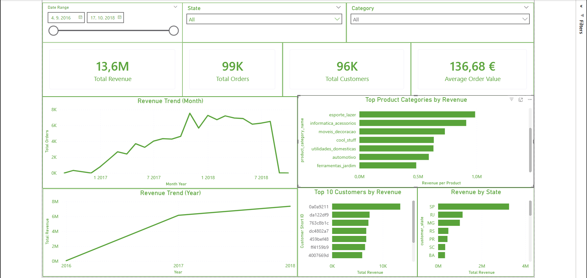

# E-Commerce Sales Dashboard (SQL + Power BI)

This project demonstrates how business intelligence dashboards can be used to analyze e-commerce sales performance.

The analysis was performed using PostgreSQL for data processing and Power BI for data visualization.

---

## Tools Used

- PostgreSQL
- SQL
- Power BI
- DAX

---

## Dataset

Brazilian E-Commerce Public Dataset by Olist.

The dataset contains information about:
- Orders
- Customers
- Products
- Payments
- Order items

---

## Business Questions

The dashboard answers the following questions:

• How does revenue evolve over time?  
• Which product categories generate the most revenue?  
• Who are the top customers by revenue?  
• Which states generate the highest sales?  
• How many orders and customers does the platform have?

---

## Key Metrics

- Total Revenue
- Total Orders
- Total Customers
- Average Order Value

---

## Dashboard Features

- Revenue trend analysis (year and month)
- Top product categories by revenue
- Top customers by revenue
- Geographic revenue distribution
- Interactive filters (date range, state, category)

---

## Dashboard Preview

---

## Project Structure
